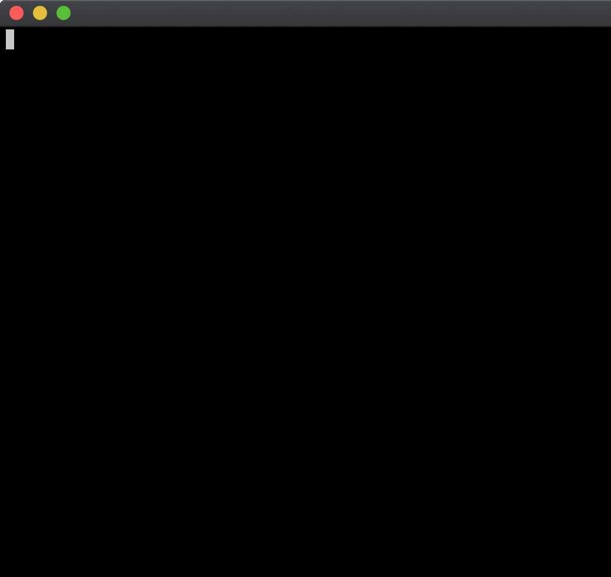
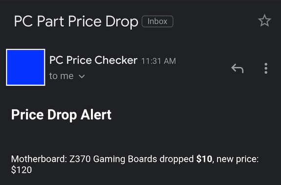

# PC Parts List
I created this when I was planning to build a new PC. A local reseller kept a Google Sheet with his inventory
and I wanted to monitor it for any price changes.  

Data is stored in a MongoDB database, and any notifications for price drops are sent using [Apprise](https://github.com/caronc/apprise).
CI/CD is currently handled by GitHub Actions.

This is a work in progress and is definitely not going to be pretty code. If you see anything especially
egregious feel free to let me know.

I'm also treating this as a fun project to practice DevOps skills, so it's most likely going to end up incredibly over-engineered.

## Usage
Set the following environment variables:
- `SHEET_ID` - ID of the spreadsheet to pull from
- `ITEM_CATEGORIES` - Comma separated list of Item categories you want
- `ITEM_RANGES` - Comma separated list of ranges on the sheet - should correspond to each of the above Item Categories
- `SHEETS_API_KEY` - API key in Google API console for this app to use
- `DB_HOST` - Hostname and port of the MongoDB server
- `CHECK_INTERVAL` (optional) - Frequency to check for new prices

Also set one of:
- `APPRISE_CONFIG_STRING` - Notification definition (useful for testing or if you don't want to manage config files)
- `APPRISE_CONFIG_URL` - Path or URL to config file for apprise notifications (e.g. if using apprise-api)

To test it out, run `docker-compose up -d`. If you're running it for the first time you will need to run
`docker exec -it apprise chown www-data:www-data /config` and then access the Web UI via http://localhost:8000/cfg/apprise 
to create a notification config (see the [Apprise docs](https://github.com/caronc/apprise/wiki) for examples)

Once you have the config, you can simulate a price drop by running `python test/pricechange.py`. On the next check
interval you should receive a notification about a price change. You can do `docker logs -f price_check` to watch it
happening in real-time.

### Demo

Example E-Mail Notification:

## TODO
- [x] Pull each item and its price per category I'm interested in from the table
- [x] Add most recent price to a db table
- [x] Send alert if any item's price changes (email/slack/sms?) - Use [apprise-api](https://github.com/bkonicek/apprise-api)?
- [ ] Notify on new items added to the table?
- [ ] Add logging
- [ ] Bulk send price drops instead of individual emails
- [x] Dockerize it
- [ ] Get environment variables from external sources (e.g. KeyVault)
- [x] Add CI
- [ ] Add CD
- [ ] Figure out where it should run from
